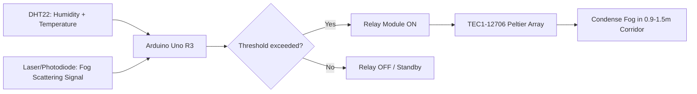
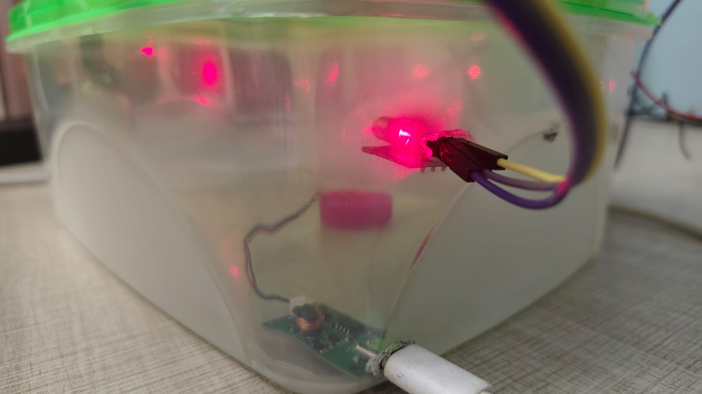
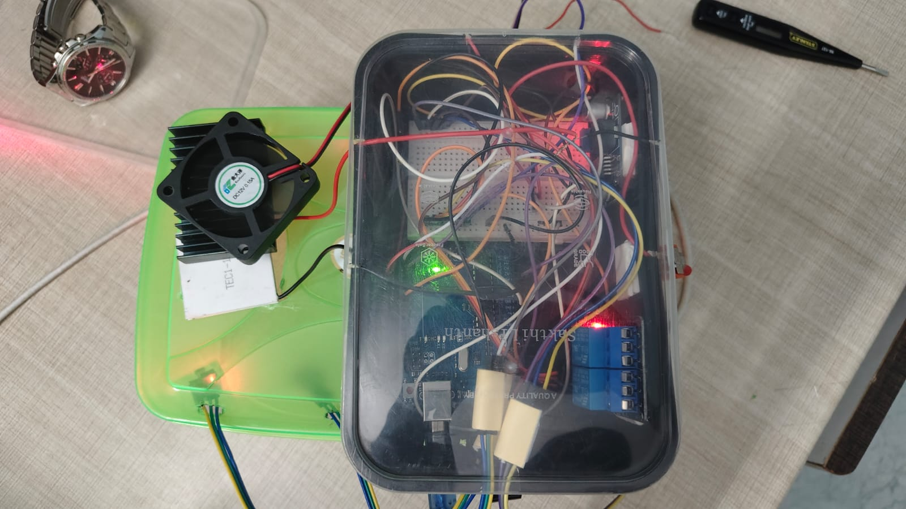
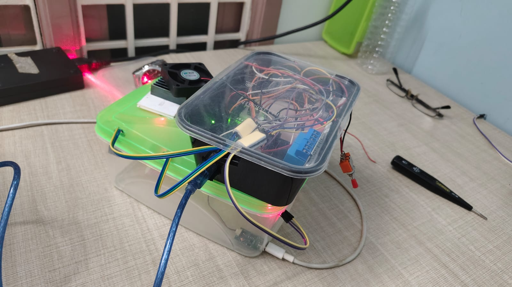
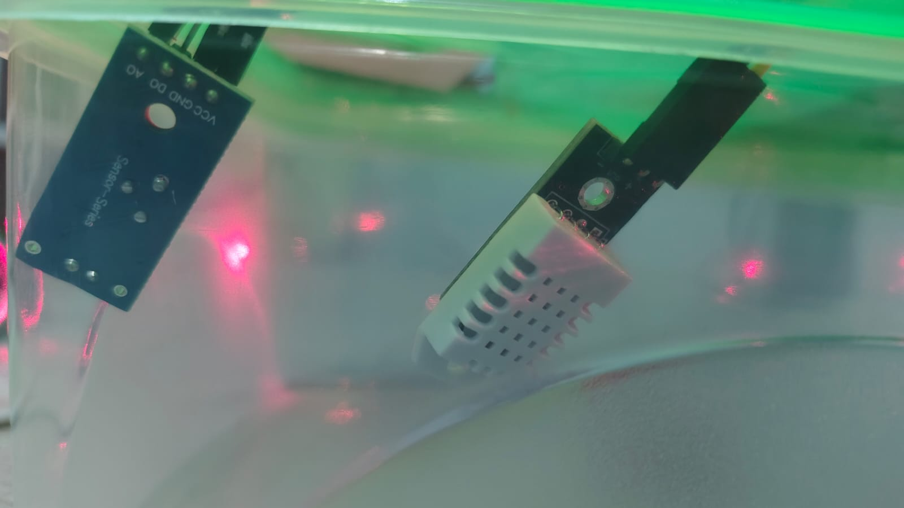
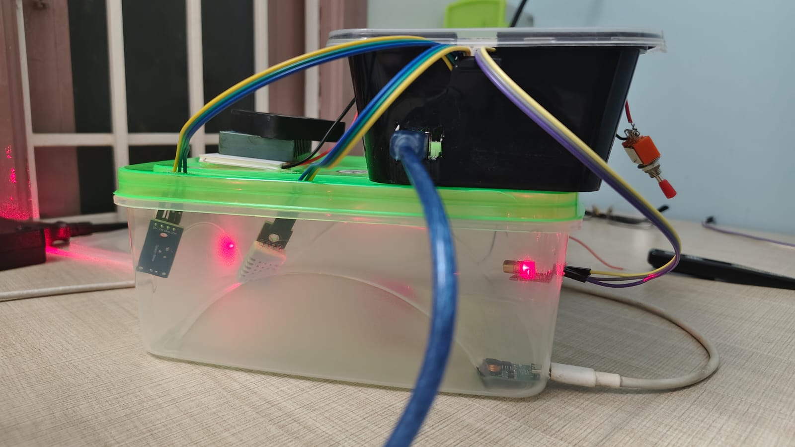

# LOVRS-AFAM: Localized Optical Vapor Recovery and Suppression

[](https://github.com/bhargava562/localized-visiblity-restoration)
[](./LICENSE)
[](https://www.arduino.cc/)
[](./code/arduino/main.ino)
[-purple)](#overview)

> A hardware-software hybrid system engineered for **surgical fog mitigation** in a driver’s line of sight.

## 📌 Overview

LOVRS (Localized Optical Vapor Recovery and Suppression), also referenced as AFAM (Atmospheric Water Generation), targets only the **0.9–1.5m Driver Optical Corridor** instead of clearing the whole environment.

This localized strategy supports:
- **Higher practical visibility gain per watt**
- **Modular deployment**
- **Fast, trigger-based operation through sensing**

## 🧊⚡ System Architecture

### Intelligence Loop (Mermaid)



### Physical Stack ("Thermal Sandwich")

**Fan → Heatsink → Peltier → Cold Plate**

- Hot side heat is actively extracted.
- Cold side promotes localized condensation.
- Stack is tuned for focused corridor restoration, not macro atmospheric clearing.

## 🧰 Hardware Specs (BOM Snapshot)

| Component | Qty | Purpose |
|---|---:|---|
| TEC1-12706 Peltier Modules | 4 | Localized thermoelectric condensation |
| Arduino Uno R3 | 1 | Control logic and sensor processing |
| DHT22 Sensor | 1 | Humidity + temperature feedback |
| Relay Module | 1 | Power switching for Peltier banks |
| 12V 10A SMPS | 2 | Power rails (2 Peltiers per supply) |
| Laser Diode + Photodiode | 1 set | Fog scattering trigger input |
| Heatsink + Fan + Cold Plate | 1 stack | Thermal sandwich assembly |

Peak estimated electrical draw: **~360W** (design peak), with intelligent duty operation to reduce average draw.

## 🎯 Resolving vs. Not Doing (Scope Control)

| Resolving | Not Doing |
|---|---|
| Restore visibility in the **driver optical corridor (0.9–1.5m)** | Attempt full macro-environment clearing |
| Convert fog risk into condensate water | Build city-scale atmospheric processors |
| Triggered operation from DHT22 + optical scatter sensing | Continuous max-power operation without sensing |
| Modular prototype-first validation | Immediate full-vehicle commercial integration |

## 💧 Resource Recovery

LOVRS reframes fog from hazard to resource:
- Condensed water can be redirected for **dust suppression** or non-potable recovery workflows.

## 🔋 Energy Efficiency Notes

- Parallelized supply strategy: **2 Peltiers per 12V 10A SMPS**.
- Sensor-driven control loop avoids unnecessary operation.
- Corridor-only targeting minimizes wasted thermal work.

## 🧪 Logic Flow (Control)

1. Read humidity/temperature from DHT22.
2. Read optical fog proxy from laser-photodiode channel.
3. If fog/humidity threshold is exceeded, switch relay ON.
4. Activate Peltier array to induce local condensation.
5. Return to standby once conditions normalize.

## 🚀 Installation and Repository Layout

```text
LOVRS-AFAM/
├── .github/
├── code/
│   ├── arduino/
│   └── scripts/
├── docs/
├── hardware/
├── assets/
├── LICENSE
├── README.md
└── requirements.txt
```

1. Flash `code/arduino/main.ino` to an Arduino Uno.
2. Wire DHT22, relay, and optical detector as per hardware schematics.
3. Power Peltier banks through relay-controlled 12V rails.
4. Tune humidity threshold and dwell timings from field observations.

---

## Media Gallery

## Screenshots






### Demonstration Videos
<video src="assets/videos/video1.mp4" controls="controls" width="100%">
  Your browser does not support the video tag.
</video>

<video src="assets/videos/video2.mp4" controls="controls" width="100%">
  Your browser does not support the video tag.
</video>


  
